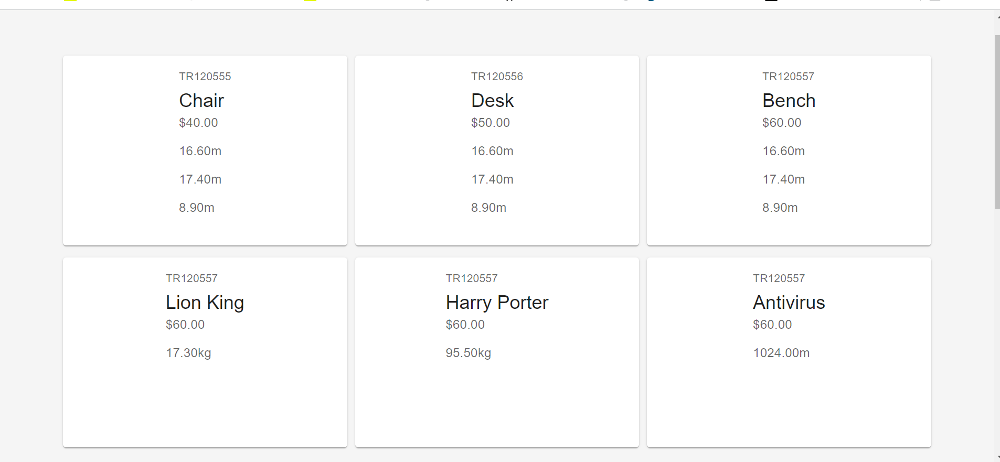

# Scandiweb Task

## File structure

### SERVER-SIDE APPLICATION (PHP BACKEND)
**object** folder contains the classes for products'. **BaseProduct.php** file is an abstract class used as the base class, **Product.php** extends the base class but contains all features that are common to all product. **DVD.php**, **Book.php** and **Furniture.php** contain specific features for each product.

**model** folder contains the database statement for Mysql in the file name **createstatement.sql** while **Database.php** contains the codes for connecting to Mysql.

**product**, **book**, **dvd** and **furniture** each contains codes for CRUD operations.

### CLIENT-SIDE APPLICATION (REACT)
**client** folder is the create-react folder for codes in React.js, client-side application

